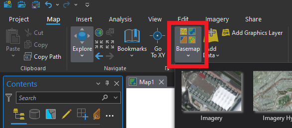
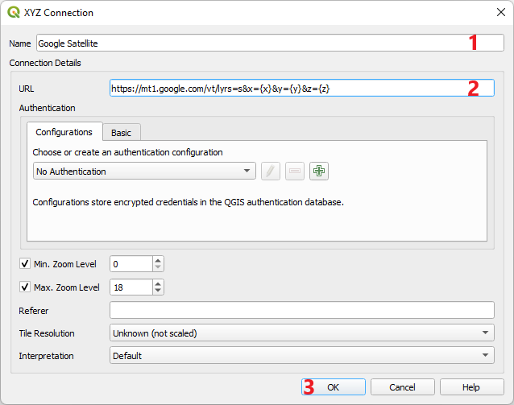
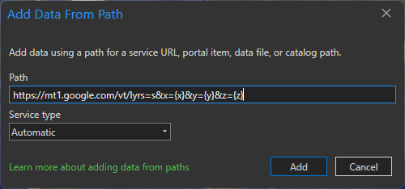
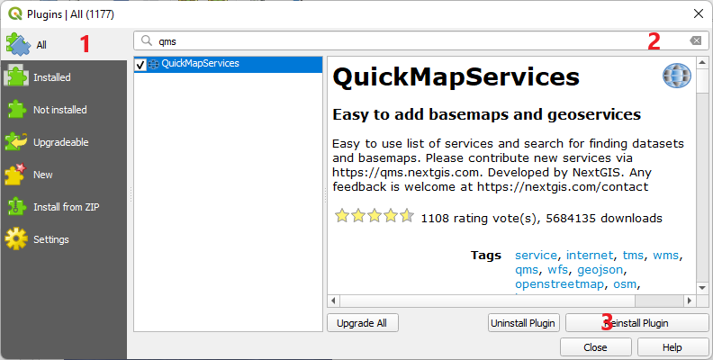
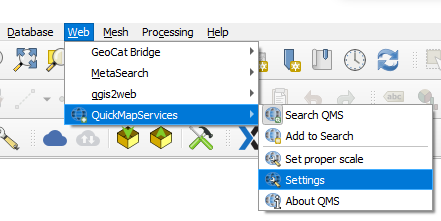
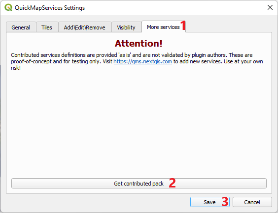
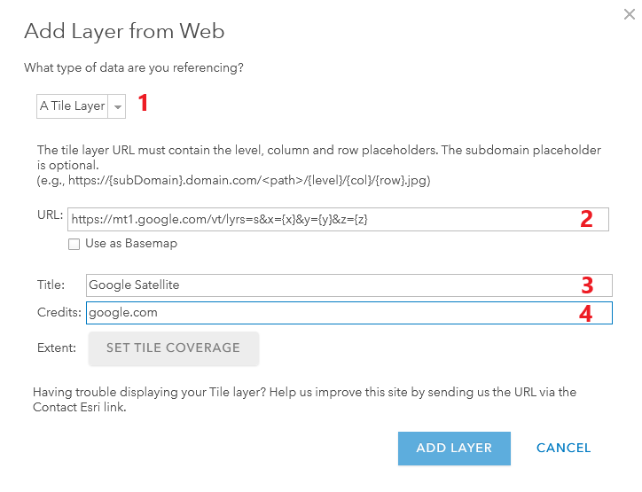
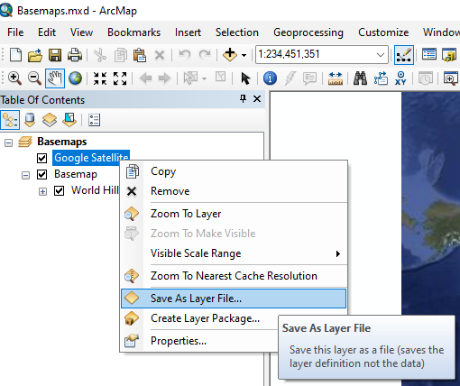

## معرفی
یکی از تفاوت‌های نقشه‌های آماتور در شهرسازی و نقشه‌های حرفه‌ای داشتن نقشه پایه یا پس‌زمینه است. در نرم‌افزار ArcGIS از ورژن ۹ امکان اضافه کردن basemap از مجموعه محدوده ESRI فراهم آمده است. اما این امکان برای محدودیت آی‌پی‌های ایران برای دسترسی به سرویس‌های آنلاین ESRI با مشکل مواجه می‌شود. در این آموزش می‌خواهیم طریقه افزودن نقشه‌های پایه را در نرم‌افزارهای ArcGIS Pro و QGIS و ArcMap با هم مرور کنیم. و با مهمترین نقشه‌های و عکس‌های ماهواره‌ای که می‌توانیم استفاده کنیم آشنا شویم.
## ارائه‌دهندگان نقشه‌های آنلاین
امروزه ارائه‌دهنده‌های مختلفی برای نقشه‌های آنلاین وجود دارند که معروف‌ترین آن‌ها گوگل، بینگ، و OpenStreetMap است. جدا از این ارائه‌کننده‌های حرفه‌ای شرکت‌های دیگر نیز به کار تولید یا توسعه نقشه‌های آنلاین پرداخته‌اند که ESRI، مپ‌باکس، و یانکس از جمله آن‌ها اند. نحوه ذخیره‌سازی و ارائه نقشه‌های آنلاین از معماری‌ای به نام کاشی (Tile) استفاده می‌کنند که بسته به طول و عرض جغرافیایی و زوم نقشه مجموعه‌ای کاشی‌وار از عکس‌های نقشه فراخوانده می‌شود. نحوه ذخیره‌سازی و فراخوانی عکس‌ها در آدرس URL نمود پیدا می‌کند که با داشتن این آدرس‌ها می‌توانیم این نقشه‌ها را به پروژه‌های GIS خود اضافه کنیم. در ادامه آدرس برخی از متداول‌ترین این نقشه‌ها را با هم مرور می‌کنیم.
### عکس ماهواره‌ای
۱. گوگل Google
    ``` 
    https://mt1.google.com/vt/lyrs=s&x={x}&y={y}&z={z} 
    ```
۲. یانکس Yanex
    ```  
    https://core-sat.maps.yandex.net/tiles?l=sat&x={x}&y={y}&z={z}&scale=1&lang=ru_RU 
    ```
۳. ESRI (نیازمند VPN)
    ```  
    https://server.arcgisonline.com/ArcGIS/rest/services/World_Imagery/MapServer/tile/{z}/{y}/{x} 
    ```
!!! نکته
    مپ‌باکس (Mapbox) و بینگ (Bing) هم از ارائه کننده‌های عکس‌های ماهواره‌ای با کیفیت اند که افزودن آن‌ها به نقشه‌ها نیازمند ثبت‌نام و دریافت api شخصی است که در آموزش تکمیلی ارائه خواهد شد.
### نقشه شماتیک معابر
۱. گوگل مپ Google Map
    ``` 
    https://mt1.google.com/vt/lyrs=m&x={x}&y={y}&z={z} 
    ```
۲. OpenStreetMap
    ``` 
    http://tile.openstreetmap.org/{z}/{x}/{y}.png 
    ```
۳. نقشه‌های معابر با استایل خاص
    ``` title="OpenTopoMap"
    https://a.tile.opentopomap.org/{z}/{x}/{y}.png 
    ```
    ``` title="CartoDB.DarkMatter"
    https://abcd.basemaps.cartocdn.com/dark_all/{z}/{x}/{y}{r}.png 
    ```
    ``` title="CyclOSM"
    https://a.tile-cyclosm.openstreetmap.fr/cyclosm/{z}/{x}/{y}.png 
    ```
!!! نکته
    مجموعه متنوعی از نقشه‌های پایه بر اساس OpenStreetMap را می‌توانید از این [لینک](https://leaflet-extras.github.io/leaflet-providers/preview/) انتخاب کنید و از آدرس نقشه مورد نظر برای افزودن نقشه پایه استفاده کنید.
        <figure markdown>
        
        <figcaption></figcaption>
        </figure>
## افزودن نقشه‌های پایه
### روش اصلی
=== "ArcGIS Pro"
    !!! warning "نکته"
        دسترسی به این بخش نرم‌افزار همانند سایر سرویس‌های آنلاین ESRI بر روی IPهای ایران بسته است و برای استفاده از آن باید از VPN یا تحریم‌شکن استفاده کنید.

    ۱. انتخاب Basemap از تب Home:
        <figure markdown>
        
        <figcaption>گزینه basemap در منوی Home در ArcGIS pro</figcaption>
        </figure>
    ۲. از مجموعه‌ نقشه‌های پایه یکی را انتخاب کنید:
        <figure markdown>
        
        <figcaption>مجموعه نقشه‌های پایه در ArcGIS Pro</figcaption>
        </figure>
=== "QGIS"
    ۱. در بخش Browser  روی XYZ Tiles کلیک راست کنید و گزینه New Connection را انتخاب کنید.
        <figure markdown>
        
        <figcaption></figcaption>
        </figure>
    ۲. در پنجره بازشده نام دلخواه و آدرس نقشه را وارد کنید.
        <figure markdown>
        
        <figcaption></figcaption>
        </figure>
    ۳. نقشه به زیر مجموعه XYZ Tiles نرم‌افزار اضافه شده و در هر پروژه QGIS می‌توانید با کلیک راست روی آن و انتخاب گزینه Add Layer to Project به پروژه خود اضافه کنید.
        <figure markdown>
        
        <figcaption></figcaption>
        </figure>
=== "ArcMap"
    ۱. از منوی پائین افتادنی کنار Add Data روی گزینه Add Basemap کلیک کنید و از بین گزینه‌های تعریف شده در نرم‌افزار Basemap مورد نظر را انتخاب و اضافه کنید.
        <figure markdown>
        
        <figcaption></figcaption>
        </figure>
    
    !!! نکته ۱
        گزینه Add Basemap در صورتی که به اینترنت وصل نباشید یا از IP ایران متصل شده باشید غیر فعال است. برای دسترسی به آن از ایران باید از VPN یا تحریم شکن استفاده کنید. 
        <figure markdown>
        
        <figcaption></figcaption>
        </figure>
    !!! نکته ۲
        در صورتی که در هنگام بازکردن نرم‌افزار VPN وصل نباشد. بعد از وصل شدن از طریق VPN روی ایکن ArcGIS کنار ساعت ویندوز کلیک راست کنید و گزینه Test Connection Now را انتخاب کنید. بعد از اتصال به سرور ArcGIS علامت ضربدر حذف می‌شود و گزینه Add Basemap فعال می‌شود.
        <figure markdown>
        
        <figcaption></figcaption>
        </figure>

### روش جانبی
=== "ArcGIS Pro"
    ۱. از زیرمجموعه Add Data در تب Home گزینه Add data from path را انتخاب کنید:
        <figure markdown>
        
        <figcaption></figcaption>
        </figure>
    ۲. آدرس نقشه آنلاین را وارد کنید:
    <figure markdown>
    
    <figcaption></figcaption>
    </figure>
=== "QGIS"
    ۱. از منو Plugin گزینه Manage and Install Plugins را انتخاب کنید.
    <figure markdown>
    
    <figcaption></figcaption>
    </figure>
    ۲. در تب All عبارت qms را جستجو کنید و پلاگین QuickMapServices را نصب کنید.
    <figure markdown>
    
    <figcaption></figcaption>
    </figure>
    ۳. بعد از نصب در منو Web از زیر مجموعه QuickMapServices بر روی Settings کلیک کنید.
    <figure markdown>
    
    <figcaption></figcaption>
    </figure>
    ۴. در تب More services پنجره Settings روی Get contributed pack کلیک کنید.
    <figure markdown>
    
    <figcaption></figcaption>
    </figure>
    ۵. بعد از دانلود مجموعه نقشه‌ها در زیرمجموعه منوی QuickMapServices لیست متنوعی از نقشه‌ها و عکس‌های هوایی از ارائه‌کننده‌ها مختلف اضافه می‌شود که می‌توانید در پروژه‌های GIS اضافه کنید.
    <figure markdown>
    
    <figcaption></figcaption>
    </figure>
    ۶. علاوه بر این لیست می‌توانید از منوی QuickMapServices گزینه Search QMS کلیک کنید و در بخش جانبی به دنبال نقشه مدنظر خود بگردید.
    <figure markdown>
    
    <figcaption></figcaption>
    </figure>
=== "ArcMap"
    ۱. در ArcGIS Online وارد اکانت خود شوید  و بعد از کلیک روی منوی Map گزینه Open in Map Viewer Classic را انتخاب کیند.
    ۲. از منوی Add گزینه Add layer from web را انتخاب کنید.
    <figure markdown>
    
    <figcaption></figcaption>
    </figure>
    ۳. گزینه A Tile Layer را انتخاب و آدرس نقشه آنلاین و عنوان مرجع را وارد کنید.
    <figure markdown>
    
    <figcaption></figcaption>
    </figure>
    ۴. نقشه را Save کنید و بعد از منوی سمت چپ بر روی   About کلیک کنید و گزینه More Details را انتخاب کنید.
    <figure markdown>
    
    <figcaption></figcaption>
    </figure>
    ۵. در پنجره باز شده روی Open in ArcGIS Desktop کلیک و Open in ArcMap را انتخاب کنید.
    <figure markdown>
    
    <figcaption></figcaption>
    </figure>
    ۶. فایل دانلود شده را باز کنید و در پروژه باز شده روی لایه نقشه آنلاین کلیک راست کنید و Save as layer را انتخاب کنید.
    <figure markdown>
    
    <figcaption></figcaption>
    </figure>
    ۷. لایه ذخیره شده را می‌توانید در هر پروژه خود اضافه کنید.


