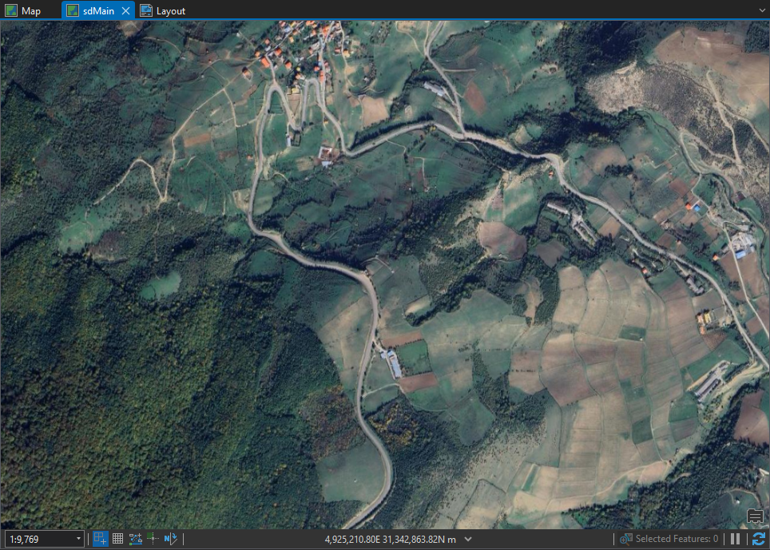
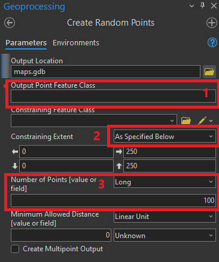
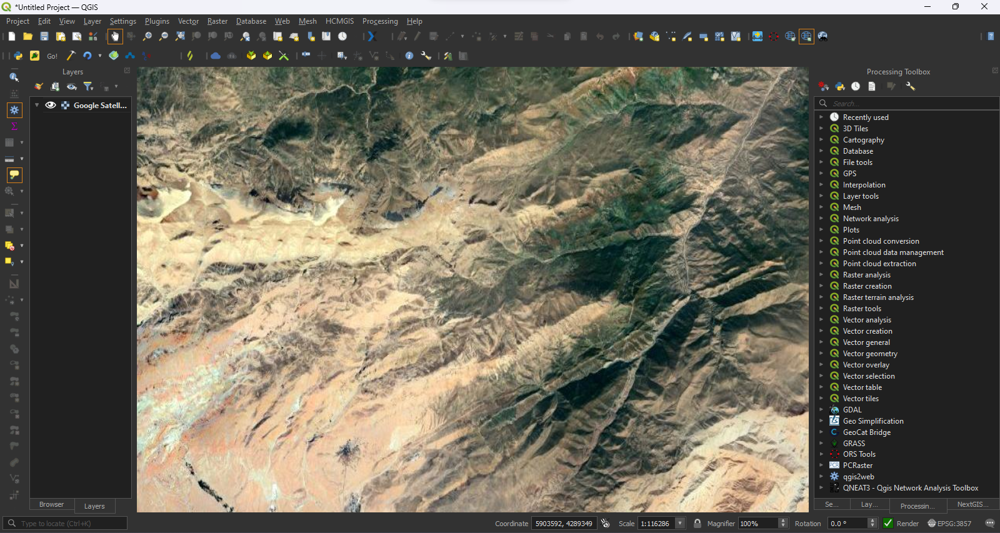
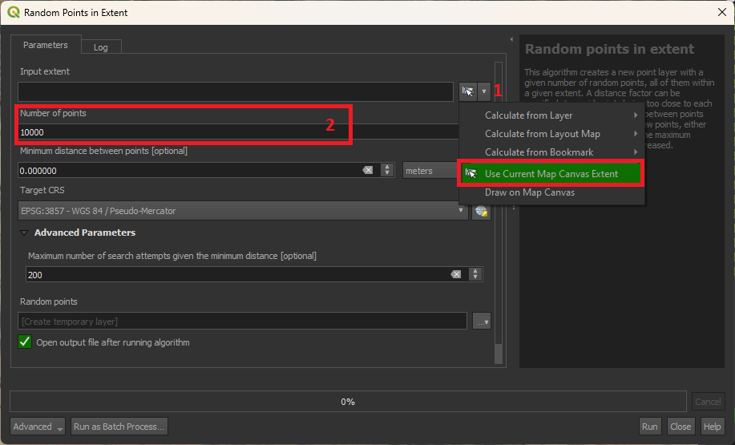
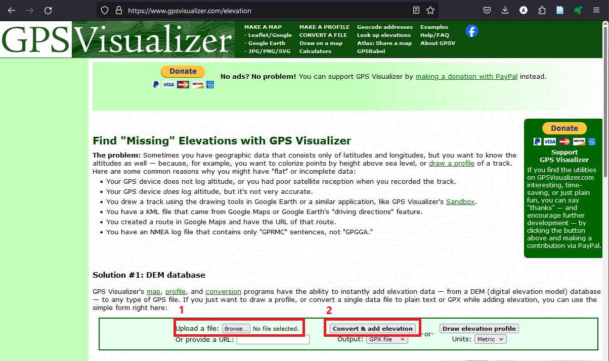
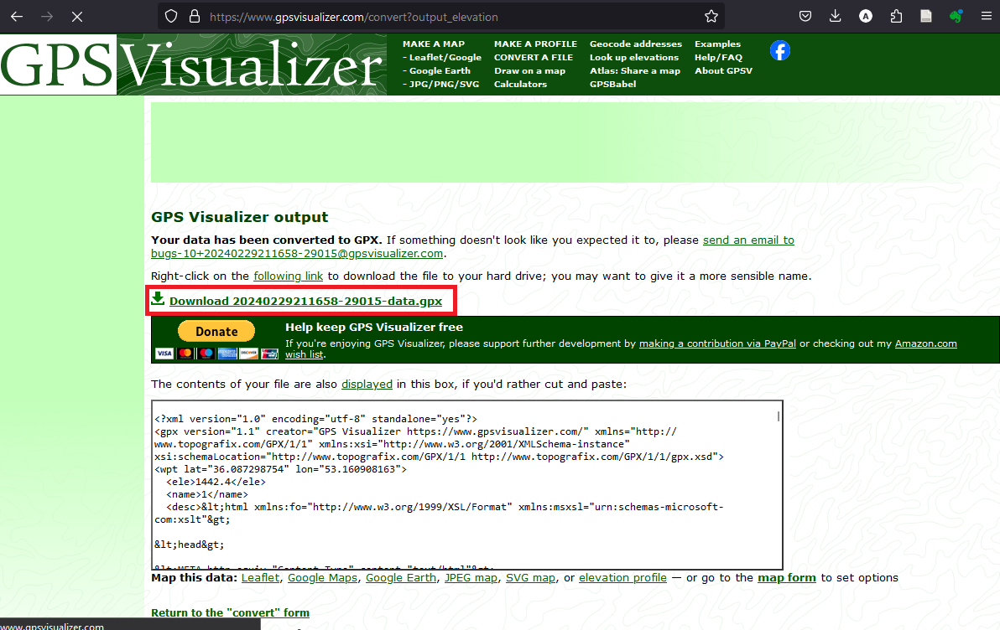
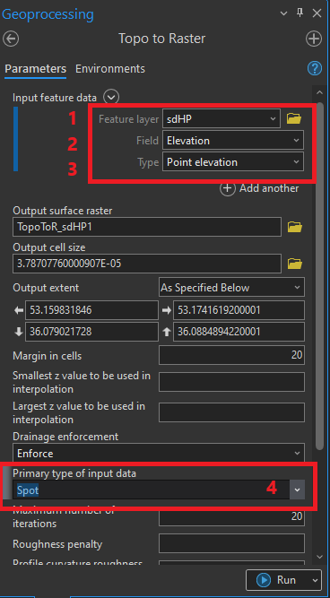

## معرفی
راه‌های بسیاری برای به دست آوردن داده‌های ارتفاعی و ساخت لایه پهنه‌بندی ارتفاعی وجود دارد. استفاده از نقاط ارتفاعی و خطوط تراز از نقشه‌های سازمان نقشه‌برداری یا استفاده از منابع جهانی مانند OpenTopography. اما هر کدام از این راه‌حل‌ها محدودیت‌هایی دارد. فرایند دشوار و پرهزینه سفارش داده‌ها و سازمان نقشه‌برداری و دقت پائیین برخی داده‌های جهانی مهمترین محدودیت‌های روش‌های رایج است. در این آموزش می‌خواهیم یکی از آسان‌ترین راه‌هایی که می‌توان از طریق آن داده‌های ارتفاعی را به دست آورد و از آن برای تهیه نقشه پهنه‌بندی ارتفاعی استفاده  کرد را با هم مرور کنیم. مراحل کار به این ترتیب است:
1. ساخت لایه‌ای از نقاط رندوم در محدوده مورد نظر؛
2. استفاده از سایت GPSVisualizer برای گرفتن ارتفاع نقاط تولید شده در مرحله اول؛
3. استفاده از خروجی مرحله دوم برای ساخت لایه ارتفاعی


### 1. ساخت لایه نقاط رندوم در GIS

=== "ArcGIS Pro"
    !!! warning "نکته"
        دسترسی به این بخش نرم‌افزار همانند سایر سرویس‌های آنلاین ESRI بر روی IPهای ایران بسته است و برای استفاده از آن باید از VPN یا تحریم‌شکن استفاده کنید.

    ۱. در محدوده مورد نظر قرار بگیرید.
        <figure markdown>
        
        </figure>
    ۲. ابزار Create random points را از مسیر زیر فرا بخوانید:
        ```  
        Toolboxes > Data Management Tools > Sampling 
        ```
    3. در پنجره Create Random Points موارد زیر را تنظیم کنید:
        1. نام و محل قرارگیری لایه خروجی
        2. محدوده مورد نظر برای تولید نقاط رندوم. در این بخش می‌توانید از گزینه Current Display Extent برای تولید نقاط در محدوده نقشه‌ای که در مرحله قبل مشخص کردید استفاده کنید.
        3. تعداد نقاط. هرچه تعداد نقاط بیشتر باشد دقت لایه خروجی بیشتر است. به دلیل محدودیت‌های سایت GPSVisualizer حداکثر 20 هزار نقطه انتخاب کنید.
        <figure markdown>
            
        </figure>
        خروجی لایه نقطه‌ای از نقاط رندوم در محدوده مورد نظر است:
        <figure markdown>
        
        </figure>
    4. تبدیل نقاط به لایه KML از طریق ابزار Layer to KML از مسیر زیر:
        ```  
        Toolboxes > Conversion Tools > KML 
        ```
=== "QGIS"
    ۱. در محدوده مورد نظر قرار بگیرید.
        <figure markdown>
        
        </figure>
    ۲. ابزار Random points in extent را از مسیر زیر فرا بخوانید:
        ```  
        Processing Toolbox > Vector creation  
        ```
    3. در پنجره Random points in extent موارد زیر را تنظیم کنید:
        1. محدوده مورد نظر برای تولید نقاط رندوم. در این بخش می‌توانید از گزینه Use Current Map Canvas Extent برای تولید نقاط در محدوده نقشه‌ای که در مرحله قبل مشخص کردید استفاده کنید.
        2. تعداد نقاط. هرچه تعداد نقاط بیشتر باشد دقت لایه خروجی بیشتر است. به دلیل محدودیت‌های سایت GPSVisualizer حداکثر 20 هزار نقطه انتخاب کنید.
        <figure markdown>
            
        </figure>
        خروجی لایه نقطه‌ای از نقاط رندوم در محدوده مورد نظر است:
        <figure markdown>
        
        </figure>
    4. تبدیل نقاط به لایه KML از طریق کلیک راست بر لایه Random Points ساخته شده و انتخاب Export > Save Features As ... لایه ساخته شده را در فرمت KML ذخیره کنید.

=== "ArcMap"
    ۱. از منوی پائین افتادنی کنار Add Data روی گزینه Add Basemap کلیک کنید و از بین گزینه‌های تعریف شده در نرم‌افزار Basemap مورد نظر را انتخاب و اضافه کنید.
        <figure markdown>
        
        <figcaption></figcaption>
        </figure>
    
    !!! نکته ۱
        گزینه Add Basemap در صورتی که به اینترنت وصل نباشید یا از IP ایران متصل شده باشید غیر فعال است. برای دسترسی به آن از ایران باید از VPN یا تحریم شکن استفاده کنید. 
        <figure markdown>
        
        <figcaption></figcaption>
        </figure>
    !!! نکته ۲
        در صورتی که در هنگام بازکردن نرم‌افزار VPN وصل نباشد. بعد از وصل شدن از طریق VPN روی ایکن ArcGIS کنار ساعت ویندوز کلیک راست کنید و گزینه Test Connection Now را انتخاب کنید. بعد از اتصال به سرور ArcGIS علامت ضربدر حذف می‌شود و گزینه Add Basemap فعال می‌شود.
        <figure markdown>
        
        <figcaption></figcaption>
        </figure>

### 2. گرفتن اطلاعات ارتفاعی از سایت GPSVisualizer

1. از [این آدرس](https://www.gpsvisualizer.com/elevation) لایه خروجی مرحله قبل را در بخش upload a file وارد کنید و گزینه convert and add elevation را انتخاب کنید.
    <figure markdown>
    
    <figcaption></figcaption>
    </figure>

2. فایل GPX خروجی را دانلود کنید.
    <figure markdown>
    
    <figcaption></figcaption>    
    </figure>

### 3. تبدیل نقاط ارتفاعی به پهنه‌بندی ارتفاعی

=== "ArcGIS Pro"
    1. تبدیل فایل GPX دانلود شده در مرحله قبل به لایه GIS از طریق ابزار GPX to Feature  در مسیر زیر:
        ```  
        Toolboxes > Conversion Tools > GPX 
        ```
    2. تبدیل نقاط ارتفاعی به پهنه‌بندی ارتفاعی از طریق ابزار از طریق ابزار Topo to Raster در مسیر زیر و مشخص کردن لایه نقاط ارتفاعی (1) فیلدی که در آن ارتفاع از سطح دریا ذخیره شده است (2)؛ و نوع داده ورودی (3: Point Elevation و 4:Spot)
        ```  
        Toolboxes > Spatial Analyst Tools > Interpolation 
        ```
        <figure markdown>
        
        <figcaption></figcaption>    
        </figure>
    <figure markdown>
    
    <figcaption></figcaption>    
    </figure>

=== "QGIS"
    ۱. از منو Plugin گزینه Manage and Install Plugins را انتخاب کنید.
    <figure markdown>
    
    <figcaption></figcaption>
    </figure>
    ۲. در تب All عبارت qms را جستجو کنید و پلاگین QuickMapServices را نصب کنید.
    <figure markdown>
    
    <figcaption></figcaption>
    </figure>
    ۳. بعد از نصب در منو Web از زیر مجموعه QuickMapServices بر روی Settings کلیک کنید.
    <figure markdown>
    
    <figcaption></figcaption>
    </figure>
    ۴. در تب More services پنجره Settings روی Get contributed pack کلیک کنید.
    <figure markdown>
    
    <figcaption></figcaption>
    </figure>
    ۵. بعد از دانلود مجموعه نقشه‌ها در زیرمجموعه منوی QuickMapServices لیست متنوعی از نقشه‌ها و عکس‌های هوایی از ارائه‌کننده‌ها مختلف اضافه می‌شود که می‌توانید در پروژه‌های GIS اضافه کنید.
    <figure markdown>
    
    <figcaption></figcaption>
    </figure>
    ۶. علاوه بر این لیست می‌توانید از منوی QuickMapServices گزینه Search QMS کلیک کنید و در بخش جانبی به دنبال نقشه مدنظر خود بگردید.
    <figure markdown>
    
    <figcaption></figcaption>
    </figure>
=== "ArcMap"
    ۱. در ArcGIS Online وارد اکانت خود شوید  و بعد از کلیک روی منوی Map گزینه Open in Map Viewer Classic را انتخاب کیند.
    ۲. از منوی Add گزینه Add layer from web را انتخاب کنید.
    <figure markdown>
    
    <figcaption></figcaption>
    </figure>
    ۳. گزینه A Tile Layer را انتخاب و آدرس نقشه آنلاین و عنوان مرجع را وارد کنید.
    <figure markdown>
    
    <figcaption></figcaption>
    </figure>
    ۴. نقشه را Save کنید و بعد از منوی سمت چپ بر روی   About کلیک کنید و گزینه More Details را انتخاب کنید.
    <figure markdown>
    
    <figcaption></figcaption>
    </figure>
    ۵. در پنجره باز شده روی Open in ArcGIS Desktop کلیک و Open in ArcMap را انتخاب کنید.
    <figure markdown>
    
    <figcaption></figcaption>
    </figure>
    ۶. فایل دانلود شده را باز کنید و در پروژه باز شده روی لایه نقشه آنلاین کلیک راست کنید و Save as layer را انتخاب کنید.
    <figure markdown>
    
    <figcaption></figcaption>
    </figure>
    ۷. لایه ذخیره شده را می‌توانید در هر پروژه خود اضافه کنید.


