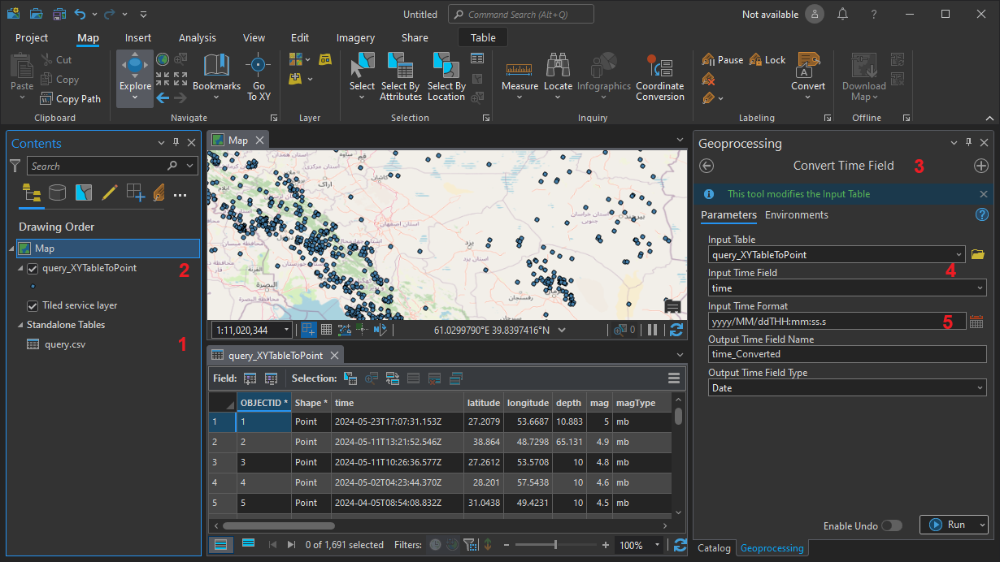
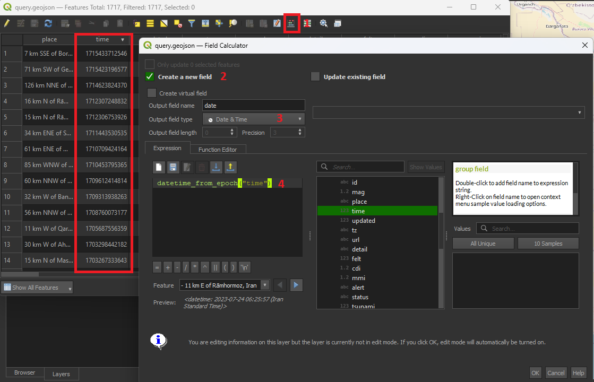
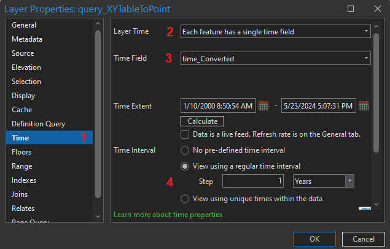
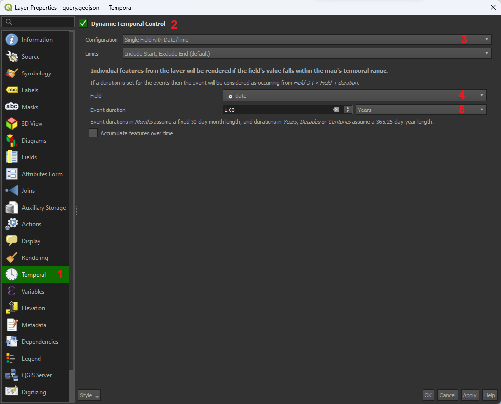
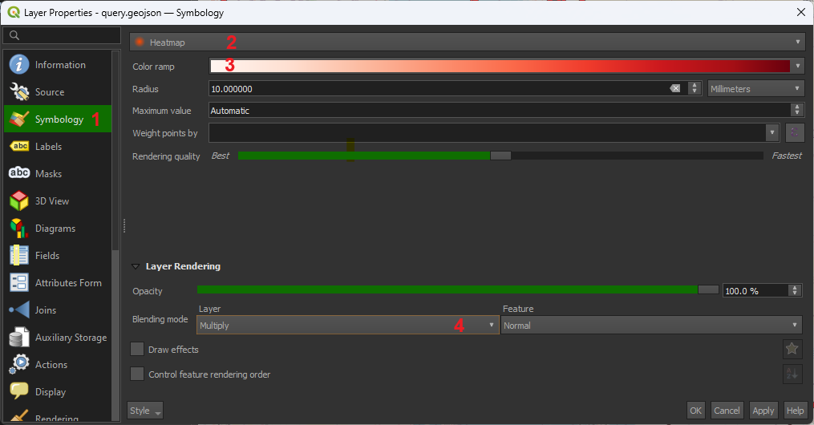
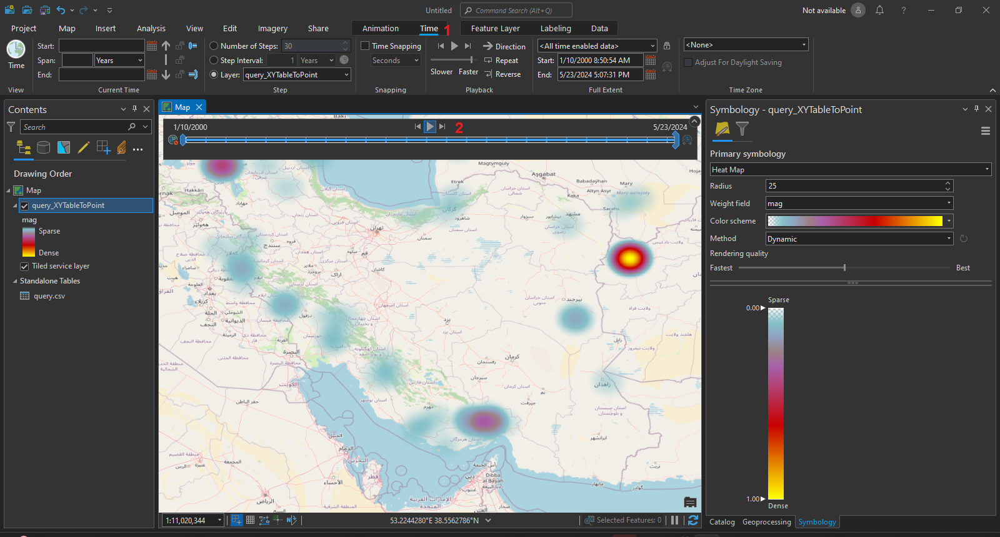
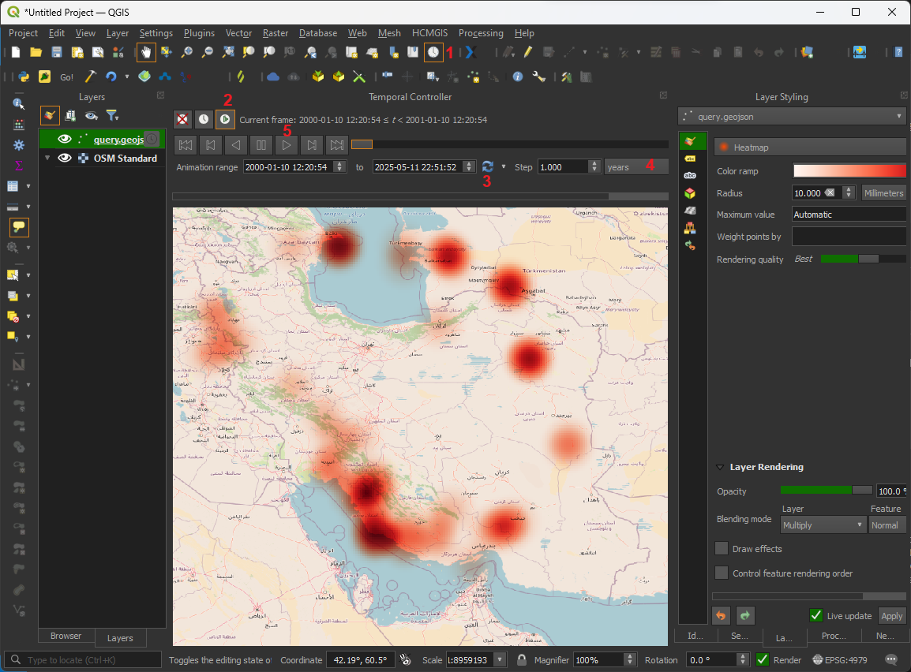
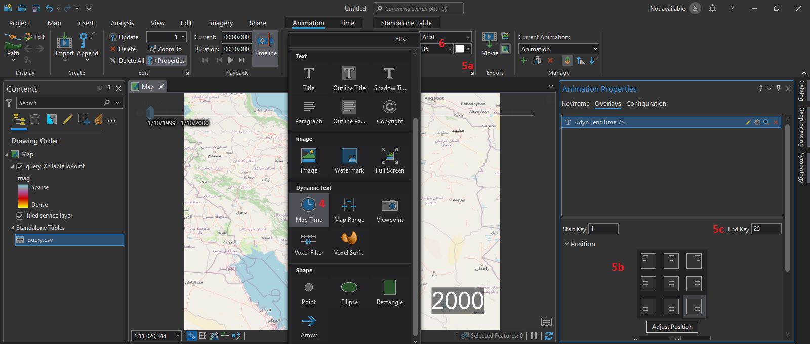
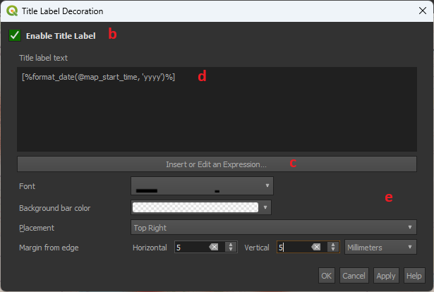
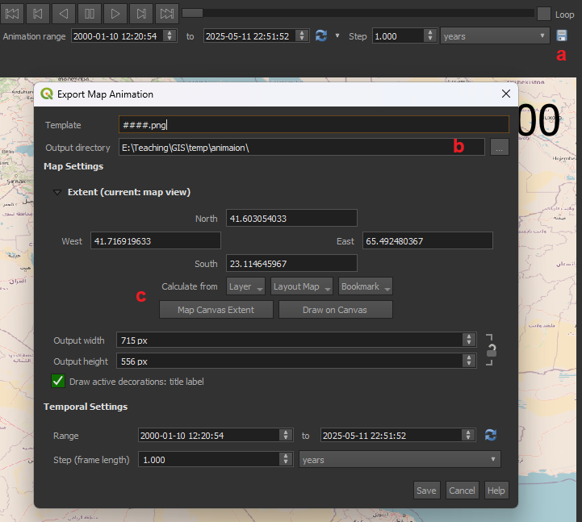

## معرفی
نقشه‌ها در طول زمان تغییر می‌کنند. گاهی نمایش نحوه تغییر داده‌ها در نقشه اطلاعات مهمی درباره نحوه پراکنش اتفاقات را به ما نمایش می‌دهند. امروزه با گسترش استفاده از نقشه‌ها تعاملی نمایش تغییرات در گذر زمان گسترش پیدا کرده است. این قابلیت در نرم‌افزارها GIS است که بعد چهارم را نیز به نمایش گذاشته شود.  یکی از پرکاربردترین روش‌های نمایش تغییرات استفاده از نقشه‌های حرارتی (Heat Maps) است. در ادامه نحوه ساخت انیمیشنی از این نقشه‌ها را با استفاده از داده‌های مربوط به زمین‌لرزه‌های 25 سال اخیر در ایران می‌بینیم.
<figure markdown>

</figure>


## ۱. آماده کردن داده‌های زمان‌مند در GIS
به طور کلی هر داده‌ای در GIS که داده توصیفی زمانی داشته باشد را می‌توان به نقشه زمان‌مند تبدیل کرد. برای این تمرین از داده‌های زمین‌لرزه از سایت USGS استفاده می‌کنیم. این داده‌ها را می‌توانید از [این آدرس](https://earthquake.usgs.gov/earthquakes/search/) دانلود کنید و در نرم‌افزار GIS وارد کنید.
 

برای تهیه نقشه زمان‌مند حتماً باید فیلدی با فرمت Date داشته باشید. در اطلاعات دریافتی از سایت USGS فیلدی به نام time وجود دارد که در آن زمان هر زمین‌لرزه وارد شده است. در ابتدا باید فیلد جدیدی با فرمت Date با محتوای این فیلد بسازیم.

=== "ArcGIS Pro"

    1. داده‌های زمین‌لرزه را در فرمت CSV [از اینجا](https://earthquake.usgs.gov/earthquakes/search/) دانلود کنید و به پروژه جدید در ArcGIS Pro اضافه کنید.
    2. با کلیک‌راست روی لایه اضافه شده و Display XY Data جدول وارد شده را به لایه جغرافیایی تبدیل کنید.
    3. از مسیر زیر ابزار Convert Time Field را انتخاب کنید.
    ```  
    Toolboxes > Data Management Tools > Fields  
    ```
    4. لایه نقطه‌ای ساخته شده را انتخاب و فیلد time را در input time field انتخاب کنید.
    5. در بخش Input Time Format فرمت زیر را وارد کنید و دستور را اجرا کنید.
    ```  
    yyyy-MM-ddTHH:mm:ss.s  
    ```
    <figure markdown>
    
    </figure>

=== "QGIS"

    1. داده‌های زمین‌لرزه را در فرمت GeoJSON [از اینجا](https://earthquake.usgs.gov/earthquakes/search/) دانلود کنید و به پروژه جدید در QGIS اضافه کنید..
    2. ساخت فیلد جدید با استفاده از Field Calculator  برای محاسبه زمان با تبدیل زمان Unix از طریق فرمول زیر:
    ```  
    datetime_from_epoch("time")  
    ```
    <figure markdown>
    
    </figure>
## ۲. تبدیل لایه به لایه زمان‌مند
=== "ArcGIS Pro"
    در Properties لایه مورد نظر:

    1. تب Time را انتخاب کنید.
    2. گزینه Single time field را در بخش Layer Time انتخاب کنید.
    3. فیلد با فرمت date ساخته شده در بخش قبل را در قسمت Time Field انتخاب کنید.
    5. ترتیب زمانی مد نظر برای مشاهده اتفاقات را در بخش Time Interval وارد کنید. 

    <figure markdown>
    
    </figure>

=== "QGIS"
    در Properties لایه مورد نظر:

    1. تب Temporal را انتخاب کنید.
    2. گزینه Dynamic Temporal Control را فعال کنید.
    3. از گزینه‌های موجود در بخش Configuration گزینه Single field with date and time را انتخاب کنید.
    4. فیلد با فرمت date ساخته شده در بخش قبل را در قسمت field انتخاب کنید.
    5. ترتیب زمانی مد نظر برای مشاهده اتفاقات را در بخش event duration وارد کنید. 

    <figure markdown>
    
    </figure>

## ۳. تنظیمات نمایش داده‌ها به صورت نقشه حرارتی
=== "ArcGIS Pro"
    1. در Symbology لایه مورد نظر گزینه Heatmap را انتخاب کنید..
    2. فیلد mag که در آن شدت زلزله مشخص شده است را به عنوان Weighted field معرفی کنید.
    3. طیف رنگی مورد نظر را انتخاب کنید.
    4. برای محاسبه خودکار شدت بر اساس داده‌ها در بخش Method گزینه Dynamic را انتخاب کنید.

    <figure markdown>
    
    </figure>

=== "QGIS"
    در Properties لایه مورد نظر:

    1. در تب Symbology وارد شوید.
    2. گزینه Heatmap را انتخاب کنید.
    3. طیف رنگی مورد نظر را انتخاب کنید.
    4. برای نمایش بهتر لایه‌های زیرین می‌توانید از Blending گزینه Multiply را انتخاب کنید.

    <figure markdown>
    
    </figure>
## ۴. نمایش نحوه تغییرات داده‌ها در طول زمان
=== "ArcGIS Pro"


    1. به محض انجام تنظیمات بالا یک نوار زمان به صورت محو در بالای نقشه و یک تب Time به تب‌های نرم‌افزار اضافه می‌شود.
    2. با کلیک بر روی گزینه Play می‌توانید تغییرات نقشه را در گذر زمان مشاهده کنید.
    <figure markdown>
    
    </figure>

=== "QGIS"

    1. در Toolbars بالای صفحه گزینه گزینه Temporal Controller Panel را انتخاب کنید.
    2. از پنل باز شده گزینه گزینه Animated temporal navigation را انتخاب کنید.
    3. بر روی گزینه Set to Full Range کلیک کنید.
    4. بازه حرکت نقشه را یک سال قرار دهید.
    5. بر روی گزینه Play کلیک کنید.

    <figure markdown>
    
    </figure>

## ۵. ساخت انیمیشن از تحولات نقشه در گذر زمان
=== "ArcGIS Pro"

    1. از تب View مجموعه Animation گزینه Add را انتخاب کنید.
    <figure markdown>
    
    </figure>    
    2. از تب Animation زیر مجموعه Import گزینه Time Slider Steps را انتخاب کنید.
    3. مدت زمان کلی Animation را در Duration وارد کنید.
    <figure markdown>
    
    </figure>
    4. در تب Animation زیرمجموعه Add Overlay گزینه Map Time را انتخاب کنید و کد زیر را برای فرمت سال وارد کنید.
    ```
    <dyn type="animation" property="endTime" format="yyyy"/>
    ```
    5. در پنل Overlay Properties محل قرارگیری (b) و تعداد فریم نمایش (c) سال را در انیمیشن تنظیم کنید.
    6. اندازه و نحوه نمایش نوشته سال را در تب Animation تنظیم کنید.
    <figure markdown>
    
    </figure>
    7. از تب Animation گزینه Export را انتخاب کنید و انیمیشن را در فرمت مورد نظر خروجی بگیرید.
    <figure markdown>
    
    </figure>
    محصول نهایی:
    <figure markdown>
    
    </figure>

=== "QGIS"

    1. نمایش تاریخ در نقشه:

        a. از منو View >> Decoration گزینه Title Label را انتخاب کنید.

        b. در پنجره باز شده گزینه Enable Title Label را انتخاب کنید.

        c. گزینه Insert or Edit Expression کلیک کیند.
        
        d. در پنجره باز شده expression زیر را وارد کنید.
            ```  
            format_date(@map_start_time, 'yyyy')  
            ```
        e. محول و نحوه نمایش عنوان را مشخص کنید.
        <figure markdown>
        
        </figure>

    2. گرفتن خروجی از فریم‌های زمانی نقشه

        a. در پنل Temporal Controller بر روی گزینه Export Animation کلیک کنید.
        b. در پنجره باز شده محل ذخیره سازی فایل‌های تصویری را مشخص کنید.
        c. محدوده نقشه را بر اساس لایه یا محدوده قابل مشاهده در نقشه تعریف کنید. 
        <figure markdown>
        
        </figure>

    3. تبدیل فریم‌های نقشه به ویدئو: از طریق نرم‌افزارهای ویرایش ویدئو می‌توانید فریم‌های ایجاد شده را به ویدئو تبدیل کنید. راحت‌ترین روش این کار از طریق نرم‌افزارها یا سایت‌های GIF ساز مانند EZGIF است.

    <figure markdown>
    
    </figure>
