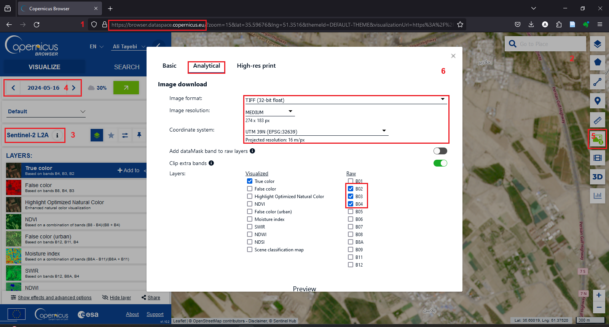
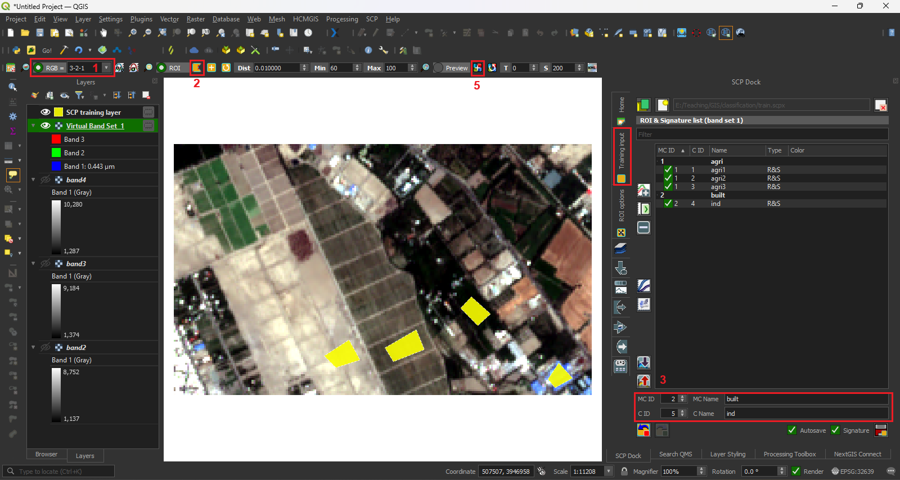
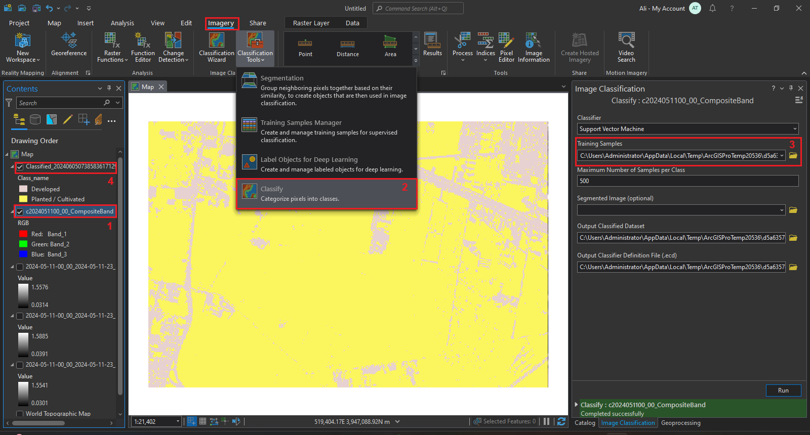
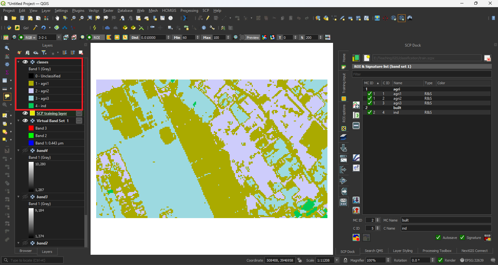

## معرفی
نقشه پوشش زمین در مقیاس منطقه‌ای نوع سطح زمین را نشان می‌دهد. این نقشه‌ها معمولاً شامل طبقه‌بندی‌هایی می‌شوند که از عکس‌های ماهواره‌ای قابل نشخیض اند و شامل محیط انسان ساخت، اراضی کشاورزی، جنگل‌ها، مراتع، سطوح آبی‌ اراضی کویری، و ... می‌شوند. برخلاف نقشه کاربری زمین، برای تهیه نقشه پوشش زمین نیازی به برداشت زمین نیست، و می‌توان با تحلیل عکس‌های ماهواره‌ای آن را تهیه و تغییرات آن را در طول زمان تحلیل کرد. در این آموزش به نحوه تهیه نقشه پوشش زمین از عکس‌های ماهواره‌ای می‌پردازیم.

## ۱. تهیه و آماده‌سازی عکس ماهواره‌ای
عکس‌های ماهواره‌ای را می‌توان از مراجع مختلف با دقت‌های متفاوت به دست آورد. مرجه رسمی تهیه عکس‌های هوایی و ماهواره‌ای در ایران، سازمان نقشه برداری است که این عکس‌ها را در بازه‌های زمانی مشخص تهیه یا جمع‌آوری می‌کنند و کاربران می‌توانند از وبسایت این سازمان عکس‌های مدنظر خود را سفارش دهند.

به غیر سازمان نقشه برداری مراجع جهانی نیز است که می‌توان عکس‌ها ماهواره‌ای را با دقت کمتر از آن‌ها به رایگان تهیه کرد. برخی از مهمترین آن‌ها عکس‌ها Landsat، Nasa، Sentinel، و Copernicus است. در این آموزش از این مراجع رایگان و جهانی استفاده می‌کنیم.

=== "ArcGIS Pro"
    ۱. وارد سایت [Copernicus Browser](https://browser.dataspace.copernicus.eu/) شوید.

    ۲. در نقشه موجود در صفحه محدوده مورد نظر خود را پیدا کنید.

    ۳. مرجع عکس ماهواره‌ای مدنظر خود را در پنل سمت چپ مشخص کنید. در این آموزش از Sentinel 2 L2A استفاده شده است.

    ۴. با استفاده از تقویم در پنل چپ، تاریخ‌هایی که از محدوده مورد نظر عکس ماهواره‌ای موجود است به شما نشان داده می‌شود. تاریخ مورد نظر خود را انتخاب کنید.

    ۵. روی علامت Download Image کلیک کنید. برای دانلود عکس‌های GeoTIF باید در سایت لاگین کنید. اگر در سایت اکانت ندارید به رایگان بسازید.

    ۶. در تب Analytic در پنجره Download Image فرمت عکس را TIFF (32bit float) با رزولوشن حداکثر و سیستم مختصات WSG 84 یا UTM قرار دهید و از باندهای عکس، باند ۲، ۳، ۴ که باندهای رنگ قرمز، سبز، و آبی اند انتخاب کنید و روی دانلود کلیک کنید.

        <figure markdown>
        
        </figure>

    ۷. لایه‌های دانلود شده را در ArcGIS Pro اضافه کنید و با استفاده از ابزار Composite Bands در آدرس زیر با هم ترکیب کنید تا لایه‌ای رستری با رنگ واقعی به دست آید.

        <figure markdown>
        
        </figure>

=== "QGIS"
    
    !!! نکته
        تهیه نقشه پوشش زمین از عکس‌های ماهواره‌ای در QGIS توسط پلاگین Semi-Automatic Classification (SCP) انجام می‌شود. برای نصب این پلاگین از منو Plugins گزینه Manage and install plugins  را انتخاب کنید و از تب All نام پلاگین یا SCP را جستجو کرده و آن را نصب کنید.

    ۱. از منو SCP گزینه Download products را انتخاب کنید.
    ۲. در قسمت Search parameters محدوده مورد نظرتان را با وارد کردن مختصات بالاترین نقطه سمت چپ (UL) و پائین‌ترین نقطه سمت راست (LR) مشخص کنید.

        !!! نکته
            می‌توانید با انتخاب + قرمز رنگ با کلیک چپ مختصات نقطه UL و با کلیک راست مختصات LR را در نقشه به صورت دستی وارد کنید.

    ۳. مرجع عکس ماهواره‌ای، بازه تاریخ عکس، و حداکثر پوشش ابر را وارد کنید و گزینه Find را کلیک کنید. در این آموزش از عکس ماهواره‌ای Sentinel استفاده شده است.

    ۴. در بخش Product list مواردی یافته شده با تاریخ و پوشش ابر آورده شده است. همه موارد به غیر از گزینه مدنظرتان را انتخاب و با گزینه - حذف کنید.

    ۵. برای این آموزش ما تنها به Band های ۲، ۳، و ۴ که شامل رنگ قرمز، سبز، و آبی می‌شوند نیاز داریم. در بخش دانلود تنها این Band ها را انتخاب کنید.

    ۶. از گزینه‌های انتهایی تنها Load bands in QGIS را انتخاب کنید و روی گزینه Run کلیک کنید. بعد از Run کردن آدرس ذخیره عکس‌ها را مشخص کنید.

        <figure markdown>
        
        </figure>

    ۷. ممکن است عکس دانلود شده محدوده بزرگتری از محدوده مدنظر شما را شامل شود. قبل از انجام تحلیل با استفاده از ابزار --- عکس‌های دانلود شده را کراپ کنید.

    ۸. تعریف band set:

        a. از منو SCP گزینه Band set را انتخاب کنید.

        b. و در پنجره باز شده هر سه عکس دانلود و کراپ شده را اضافه کنید.

        c. مرجه عکس را در wavelength انتخاب کنید.

        d. در بخش پائینپنجره تمام گزینه‌ها را انتخاب کنید.

        e. گزینه Run را کلیک و محل ذخیره را تعیین کنید.

        <figure markdown>
        
        </figure>

## ۲. تعلیم مدل

=== "ArcGIS Pro"
    ۱. لایه عکس ماهواره‌ای با ترکیب رنگ واقعی را انتخاب کنید. 

    ۲. وارد تب Imagery شوید و از زیر مجموعه Classification Tools گزینه Training Samples Manager را انتخاب کنید. 

    ۳. در پنجره این ابزار به صورت پیشفرض آخرین ورژن طبقه‌بندی NLCD برای پوشش زمین آورده شده است. در صورت نیاز می‌توانید طبقه‌بندی را بر اساس نیاز خود تغییر دهید.

    ۴. برای معرفی نمونه برای هر طبقه، طبقه مد نظر را انتخاب کنید و نمونه آن را با ابزارهای ترسیمی نوار بالای این پنجره در عکس ماهواره‌ای ترسیم کنید.

    ۵. این مرحله تا انتخاب نمونه‌های متنوع و کافی برای تمام طبقات مدنظر خود ادامه دهید.

    ۶. بعد از تکمیل نمونه‌های لایه نمونه‌ها را در محیط پائین این پنجره ذخیره کنید.

    <figure markdown>
    
    </figure>

=== "QGIS"

    ۱. در تولبار SCP سه باند مرتبط با رنگ قرمز،‌آبی، و سبز را با هم ترکیب کنید تا رنگ واقعی عکس ماهواره‌ای به دست آید.

    ۲. از تولباز SCP ابزار Create a ROI polygon را انتخاب کنید و بخشی از عکس هوایی را به عنوان نمونه یک پوشش زمین انتخاب کنید.

    ۳. در پنل SCP تب Training Input برای بخش انتخاب شده دسته اصلی (MC) و طبقه مشخص تعریف کنید.
    
    ۴. مرحله سه را تا جایی که از همه دسته‌های مدنظر به اندازه کافی نمونه انتخاب کرده باشید ادامه دهید.

    ۵. برای اطمینان از درست تعلیم شدن مدل می‌توانید از ابزار Active classification preview pointer در تولبار SCP در بخش‌هایی از عکس ماهواره‌ای که نمونه گرفته نشده است استفاده کنید و درستی خروجی را امتحان کنید.

    <figure markdown>
    
    </figure>

## ۳. طبقه‌بندی عکس ماهواره‌ای و تهیه نقشه پوشش زمین

=== "ArcGIS Pro"

    ۱. لایه عکس ماهواره‌ای با ترکیب رنگ واقعی را انتخاب کنید. 

    ۲. وارد تب Imagery شوید و از زیر مجموعه Classification Tools گزینه Classify را انتخاب کنید. 

    ۳. در پنجره این ابزار فایل Train ساخته شده در مرحله قبل را در بخش Training Samples معرفی کنید.

    ۴. مدل را اجرا کنید. لایه پوشش زمین با طبقه‌بندی تعریف شده و بر اساس نمونه‌های تعلیم داده شده ساخته می‌شود.
    
    <figure markdown>
    
    </figure>

=== "QGIS"

    ۱. از منو SCP زیر مجموعه Band processing گزینه Classification را انتخاب کنید.

    ۲. در پنجره باز شده انتخاب کنید که از طبقه بندی اصلی (Macroclass) یا فرعی (Class) برای ساخت لایه پوشش زمین استفاده کند.

    ۳. ابزار را اجرا کنید نقشه پوشش زمین با طبقه‌بندی تعریفی شما ساخته می‌شود.

    <figure markdown>
    
    </figure>

    <figure markdown>
    
    </figure>

