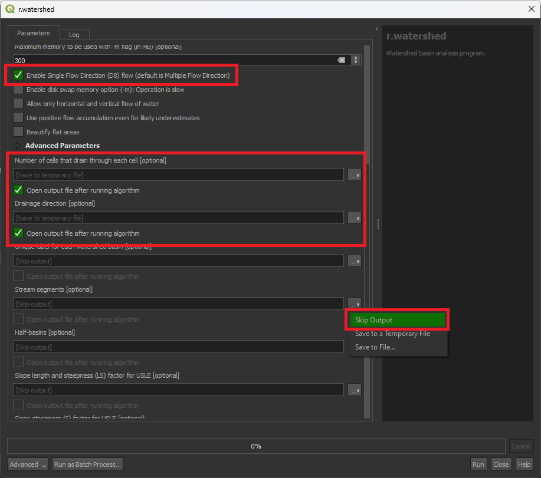
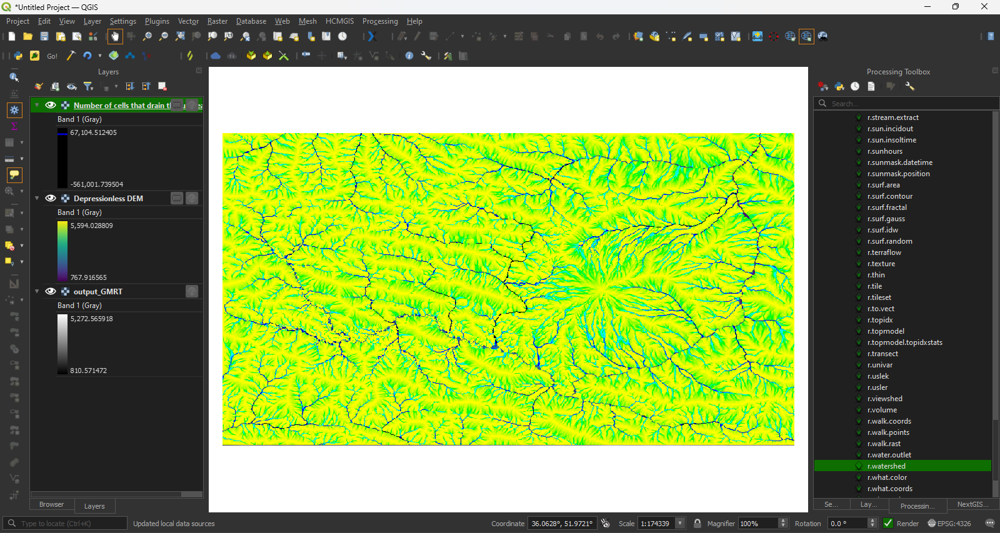
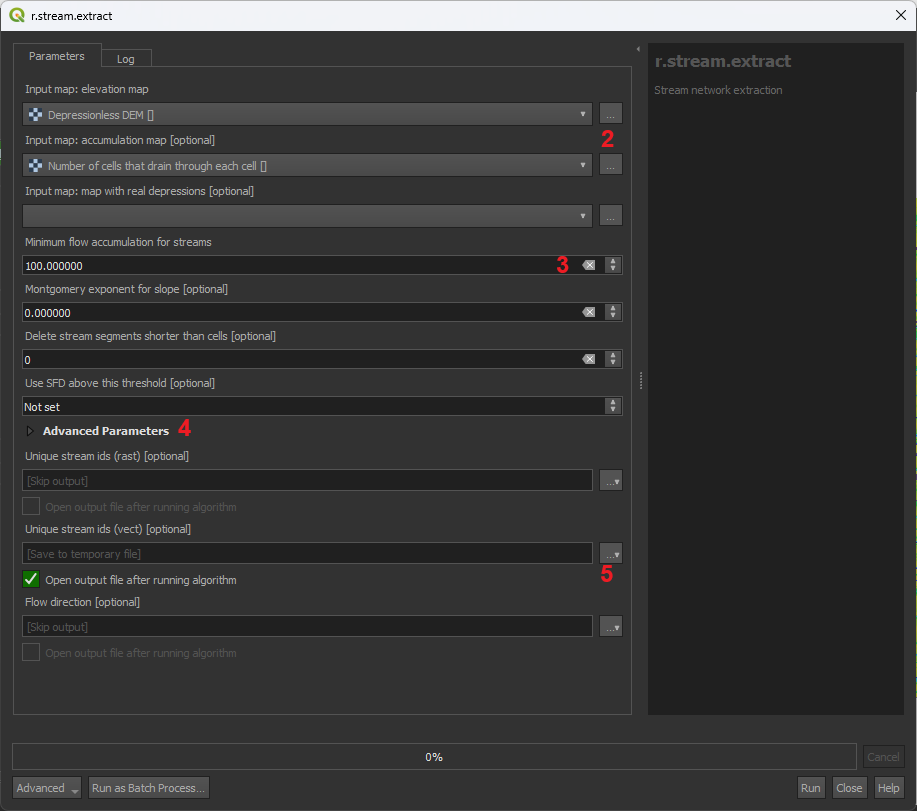
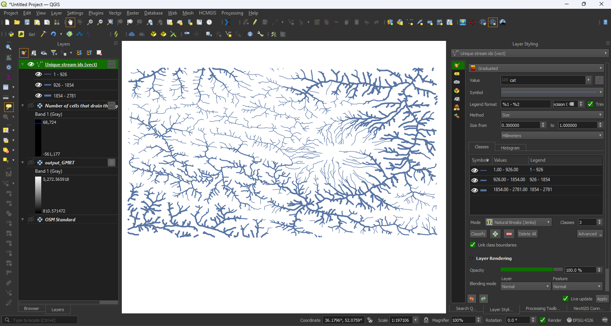

## معرفی
مسیر حرکت آب‌های سطحی یکی از مهمترین مؤلفه‌هایی است که باید در تحلیل‌های منطقه‌ای در نظر گرفته شود. نادیده‌گرفتن این مؤلفه‌ در محیط‌های انسان‌ساخت منجر به خسارات زیادی در بارش‌های شدید در مقیاس‌های مختلف می‌شود. در این آموزش نگاه می‌کنیم تا با تنها داشتن لایه سطح چه گونه می‌توانیم مسیر حرکت آب‌های سطحی و حوزه‌های آبخیز را به دست آوریم.

## ۱. تهیه لایه سطح
برای به دست آوردن مسیر حرکت آب‌های سطحی و حوزه‌های آبخیز تنها با لایه سطح (elevation/DEM) نیاز داریم. برای به دست آوردن لایه سطح منابع متعددی وجود دارد. مرجه رسمی این لایه در ایران سازمان نقشه‌برداری است که از سامانه این سازمان این لایه را با دقت بالا می‌توانید تهیه کنید. اما مراجع جهانی زیادی نیز وجود دارد که این داده را به صورت آزاد و رایگان در اختیار قرار می‌دهند. یکی از معتبرترین مراجعی که دسترسی به طیف گسترده‌ای به داده‌های این مراجع را فراهم کرده است، سایت OpenTopography است. برای به دست آوردن داده سطح از این مرجع مراحل زیر را انجام دهید.

1. به سایت [OpenTopography](https://opentopography.org/) بروید و از منو Data گزینه Find Data Map را کلیک کنید.
2. از نقشه موجود در صفحه با استفاده از ابزار Select a Region محدوده مدنظرتان را انتخاب کنید.

    !!! warning "نکته"
        نقشه پایه این صفحه از نقشه ESRI استفاده می‌کند و همانند سایر سرویس‌های آنلاین ESRI بر روی IPهای ایران بسته است و برای مشاهده آن باید از VPN یا تحریم‌شکن استفاده کنید.

3. بعد از انتخاب محدوده در بخش پائینی همین صفحه مراجعی که محدوده انتخاب شده را پوشش می‌دهند برای شما آورده می‌شود. گزینه‌های موجود برای ایران معمولاً در تب Global & Regional DEM آورده شده است.
4. از گزینه‌های موجود گزینه مدنظرتان را با کلیک بر حروف اختصاری آبی رنگ در سمت راست انتخاب کنید.

    !!! نکته
        تفاوت بین گزینه‌ها در دقت یا رزولوشن لایه ارتفاعی و نحوه محاسبه ارتفاع برای بهینه‌سازی نتیجه است. 
        گزینه پیشنهادی: Global Multi-Resolution Topography (GMRT) Data Synthesis 

5. بعد از انتخاب گزینه به فرم درخواست هدایت می‌شوید که در آن فرمت، دقت، و لایه‌های جانبی مدنظر را از شما پرسیده می‌شود و در نهایت عنوان کار درخواستی و آدرس ایمیل برای اطلاع‌رسانی درباره آماده شدن درخواست پرسیده می‌شود.

    !!! نکته
        می‌توانید با ثبت‌نام رایگان در این سایت به سابقه درخواست‌های خود دسترسی داشته باشید.

6. بعد از ثبت، درخواست شما در صف درخواست‌ها قرار می‌گیرد و اندکی بعد لینک دانلود لایه مدنظر برای شما نمایش داده می‌شود.

## ۲. آماده‌سازی لایه‌های مورد نیاز برای تحیل

=== "ArcGIS Pro"
    
    1. لایه سطح را به پروژه جدید اضافه کنید.
    2. برای انجام تحیل‌های آب‌شناسی در GIS ابتدا باید خَلل و فرجی (sink/depression) که ممکن است در آن وجود داشته باشد که مانع از حرکت آب سطحی می‌شود 
    برای این کار از ابزار Fill در آدرس زیر استفاده کنید.
        ```
        Toolboxes > Spatial Analyst Tools > Hydrology 
        ```

        !!! نکته
            از این‌ پس از لایه Fill_* خروجی مرحله قبل به عنوان لایه ارتفاعی استفاده می‌کنیم.

    3. جهت حرکت آب‌های سطحی را با ابزار Flow Direction در مجموعه Hydrology محاسبه کنید. در پنجره این ابزار ورودی را لایه Fill_ معرفی کنید و Flow direction type را D8 قرار دهید.
        <figure markdown>
        
        </figure>
    4. لایه تجمیع آب‌های سطحی را با استفاده از ابزار Flow Accumulation محاسبه کنید. ورودی این مرحله خروجی مرحله قبل (FlowDir_Fill) است. 
        <figure markdown>
        
        </figure>


=== "QGIS"

    1. لایه سطح را به پروژه جدید اضافه کنید.
    2. برای انجام تحیل‌های آب‌شناسی در GIS ابتدا باید خَلل و فرجی (sink/depression) که ممکن است در آن وجود داشته باشد که مانع از حرکت آب سطحی می‌شود از بین ببریم. برای این‌کار از آدرس زیر در Processing Toolbox ابزار r.fill.dir را انتخاب کنید و با انتخاب لایه ارتفاعی آن را اجرا کنید.
        ```
        Processing Toolbox > GRASS > Raster (r.*) 
        ```
        <figure markdown>
        
        </figure>

        !!! نکته
            از این‌ پس از لایه Depressionless DEM خروجی مرحله قبل به عنوان لایه ارتفاعی استفاده می‌کنیم.

    3. ساخت لایه Flow Accumulation: برای ساخت این لایه ابزار r.watershed را از آدرس زیر انتخاب کنید. 
        ```
        Processing Toolbox > GRASS > Raster (r.*) 
        ```
        این ابزار خروجی‌های متنوعی را برای تحلیل‌های آب‌شناسی ارائه می‌کند.

        از گزینه‌های موجود گزینه Enable Single Flow Direction (D8) را انتخاب کنید. 
 
        برای تحلیل مدنظر این آموزش ما تنها به خروج Flow Accumulation  و Flow Direction نیاز داریم. برای دریافت این خروجی‌ها تنها گزینه‌های  Number of cells that drain through each cell و Drainage Direction را انتخاب کنید و بقیه گزینه‌ها را Skip کنید.

        <figure markdown>
        
        </figure>
        <figure markdown>
        
        </figure>

## ۳. تهیه لایه مسیر حرکت آب‌های سطحی

=== "ArcGIS Pro"

    1. از زیر مجموعه تحلیل‌های Hydrology ابزار Derive Stream As Line را انتخاب کنید.

    2. لایه اصلاح شده ارتفاعی (fill_) را به عنوان Input وارد کنید.
    3. در بخش Accumulation threshold عددی که برای شناسایی مسیر آبی است را بر اساس ورودی به شما پیشنهاد می‌دهد. هرچه عدد بزرگ‌تر باشد خروجی شامل مسیرهای اصلی‌تر و هرچقدر کوچک‌تر باشد شامل مسیرهای فرعی‌تر می‌شود.
    4. در بخش Stream designation method روش Strahler را انتخاب کنید.
    5. خروجی لایه‌ای وکتوری از جنس خط است که در Attribute table آن فیلدی به نام StrahlerID وجود دارد که در آن سلسله مراتب مسیرهای آبی بر اساس حجم تجمیعی جریان آب وارد شده است. می‌توانید از این فیلد برای نمایش نقشه استفاده کنید.
        <figure markdown>
        
        </figure>


=== "QGIS"
    1. برای به دست آوردن مسیر حرکت آب‌های سطحی ابزار r.stream.extract را از مسیر زیر انتخاب کنید.

        ```
        Processing Toolbox > GRASS > Raster (r.*) 
        ```

    2. در پنجره باز شده لایه ارتفاعی اصلاح شده و لایه Flow Acumulation ساخته شده در مرحله قبل را به عنوان ورودی انتخاب کنید. 
    3. در قسمت Minimum acumulation for stream از شما عددی می‌خواهد که اگر تجمع آب از آن بیشتر بود به عنوان مسیر حرکت آب سطحی شناسایی کند. هرچه عدد بزرگ‌کتر باشد مسیرهای اصلی‌تر و هرچه کوچک‌تر باشد مسیرهای فرعی‌تر را شناسایی می‌کند.

        !!! نکته
            پیشنهاد می‌شود از عدد بزرگ‌تر (مثلاً 100 ) شروع کنید و اگر مسیرهای فرعی‌تر را نیاز داشتید عدد کوچک‌تری وارد کنید.

    4. در بخش v.out.ogr output type نوع خروجی را line انتخاب کنید.
    5. در بخش انتخایی پنجره از خروجی‌های قابل محاسبه تنها Unique stream ids (vect) که شامل مسیرهای وکتوری حرکت آب‌های سطحی را انتخاب کنید و بقیه را Skip کنید.
        <figure markdown>
        
        </figure>
    6. در Attribute table لایه خروجی مرحله قبل، سلسله مراتب مسیرهای آبی بر اساس میزان آب تجمیعی در فیلد cat ذخیره شده است که بر اساس آن می‌توانیم نحوه نمایش لایه را تغییر دهید.
        <figure markdown>
        
        </figure>

## ۴. تعیین حوزه‌های آب‌خیز

=== "ArcGIS Pro"
    1. از مجموعه ابزارهای تحلیلی Hydrology ابزار Watershed را انتخاب کنید.
    2. در پنجره این ابزار لایه جهت جریان (FlowDir_) را به عنوان Input D8 flow direction معرفی کنید.
    3. نقطه‌ای که می‌خواهید حوزه آب‌خیز آن را محاسبه کنید را در بخش Input raster or feature pour data معرفی کنید. 

        !!! نکته
            از ایکون مداد جلوی این بخش می‌توانید نقطه را در نقشه به صورت دستی مشخص کنید. دقت کنید که نقطه انتخاب باید در مسیرهای حرکت آب‌های سطحی باشد.
            در این مثال نقطه منتهی به سد لار انتخاب شده تا حوزه آب‌خیز این سد حاصل شود.

    4. فیلد OBJECTID یا FID را به عنوان Pour point field معرفی کنید.
        <figure markdown>
        
        </figure>
    5. می‌توانید با استفاده از ابزار Raster to Polygon برای تبدیل لایه حوزه آب‌خیز به وکتور استفاده کنید.

=== "QGIS"
    برای تعیین حوزه‌های آب‌خیز در QGIS از ابزار r.water.outlet در مسیر زیر استفاده می‌کنیم.
        ```
        Processing Toolbox > GRASS > Raster (r.*) 
        ```

    1. در پنجره ابزار لایه Drainage Direction تهیه شده در مرحله دوم را انتخاب کنید.
    2. در قسمت coordinate of outlet point مختصات نقطه‌ای را که می‌خواهید حوزه آب‌خیز را به دست آورید وارد کنید. 

        !!! نکته
            از ... جلوی این بخش می‌توانید نقطه را در نقشه به صورت دستی مشخص کنید. دقت کنید که نقطه انتخاب باید در مسیرهای حرکت آب‌های سطحی باشد.
            در این مثال نقطه منتهی به سد لار انتخاب شده تا حوزه آب‌خیز این سد حاصل شود.
        
        <figure markdown>
        
        </figure>
        <figure markdown>
        
        </figure>

    3. می‌توانید با ابزار r.to.vect خروجی به دست آمده در مرحله قبل را به وکتور تبدیل کنید.